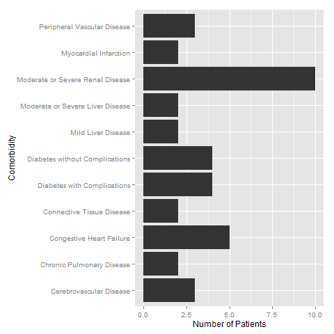

Charlson Comorbidity Index Calculator
=====================================

The Charlson index is a commonly used tool to assess medical commodities, and to adjust for risk in health-care services and research [1][1] [2][2]. 
Electronic medical records(EMR) are widespread today, and diagnosis codes are usually easily extracted from the EMR.
The program here processes ICD9 codes for a given number of patients, and produces a Charlson comorbidity table along with a calculated Charlson score. 

# How to use the program
The program is written in the R programming language. It requires [R][3] to be installed, along with the following packages: `reshape2`, `plyr`, and `ggplot2`.
In order to use the program, you will have to add patient identifiers, along with corresponding ICD9 codes to the `input` folder. With this current built, some test patients are added so that the program can run. Here is what you need to do:

- Replace `Patients1.csv`. This file contains patients identifiers (MRN), date of birth (DOB), and date of hospitalization (DOH). Here is how the file look like: 

```
##   MRN        DOB        DOH
## 1  26 1941-11-30 2014-02-19
## 2  27 1942-07-26 2012-04-14
## 3  28 1959-11-12 2014-03-16
## 4  29 1976-08-10 2014-06-19
## 5  30 1934-09-22 2013-09-17
## 6  31 1936-02-22 2014-01-10
```


- Replace `Patients2.csv`. This file contains the ICD9 codes along with the dates when the diagnoses were made. Here is how the file looks like:

```
##   MRN  ICD9 DiagnosisDate
## 1  26 27541    2013-12-18
## 2  26 27541    2013-12-21
## 3  26 27541    2013-12-24
## 4  26 27541    2013-12-28
## 5  26 27541    2013-12-31
## 6  26 27541    2014-01-01
```


- All the dates should be in the following format: `YYYY-MM-DD`

- The program defaults to only accepting ICD9 diagnoses that were made within 5 years of the hospitalization date. However, you can change this by changing the number in `CharlsonRules4.csv` file.

- After you change the files as outlined above, run `CharlsonCalc.R` file. Make sure that the working directory is set to where this file is. You can use `setwd` function to change the working directory. 

# Output
The information is processed, and two files are written to the `output` folder. `Charlson.csv` is a table with the patients, their comorbidities, and their Charlson score. `Graph.png` summarizes the comorbidities for all patients. Here is how the output looks like:


```
##    MRN Myocardial Infarction Congestive Heart Failure
## 1   26                 FALSE                    FALSE
## 2   27                 FALSE                     TRUE
## 3   28                 FALSE                    FALSE
## 4   29                 FALSE                    FALSE
## 5   30                  TRUE                     TRUE
## 6   31                 FALSE                     TRUE
## 7   32                 FALSE                    FALSE
## 8   33                  TRUE                     TRUE
## 9   34                 FALSE                     TRUE
## 10  35                 FALSE                    FALSE
##    Peripheral Vascular Disease Cerebrovascular Disease Dementia
## 1                         TRUE                   FALSE    FALSE
## 2                        FALSE                    TRUE    FALSE
## 3                        FALSE                    TRUE    FALSE
## 4                        FALSE                   FALSE    FALSE
## 5                        FALSE                   FALSE    FALSE
## 6                        FALSE                   FALSE    FALSE
## 7                        FALSE                    TRUE    FALSE
## 8                         TRUE                   FALSE    FALSE
## 9                        FALSE                   FALSE    FALSE
## 10                        TRUE                   FALSE    FALSE
##    Chronic Pulmonary Disease Connective Tissue Disease
## 1                      FALSE                     FALSE
## 2                       TRUE                      TRUE
## 3                      FALSE                     FALSE
## 4                      FALSE                     FALSE
## 5                       TRUE                     FALSE
## 6                      FALSE                     FALSE
## 7                      FALSE                     FALSE
## 8                      FALSE                     FALSE
## 9                      FALSE                      TRUE
## 10                     FALSE                     FALSE
##    Peptic Ulcer Disease Mild Liver Disease Diabetes without Complications
## 1                 FALSE              FALSE                          FALSE
## 2                 FALSE              FALSE                          FALSE
## 3                 FALSE               TRUE                           TRUE
## 4                 FALSE              FALSE                          FALSE
## 5                 FALSE              FALSE                          FALSE
## 6                 FALSE              FALSE                           TRUE
## 7                 FALSE              FALSE                          FALSE
## 8                 FALSE              FALSE                           TRUE
## 9                 FALSE              FALSE                          FALSE
## 10                FALSE               TRUE                           TRUE
##    Diabetes with Complications Hemiplegia or Paraplegia
## 1                        FALSE                    FALSE
## 2                        FALSE                    FALSE
## 3                         TRUE                    FALSE
## 4                         TRUE                    FALSE
## 5                        FALSE                    FALSE
## 6                         TRUE                    FALSE
## 7                        FALSE                    FALSE
## 8                         TRUE                    FALSE
## 9                        FALSE                    FALSE
## 10                       FALSE                    FALSE
##    Moderate or Severe Renal Disease Malignancy without Metastases
## 1                              TRUE                         FALSE
## 2                              TRUE                         FALSE
## 3                              TRUE                         FALSE
## 4                              TRUE                         FALSE
## 5                              TRUE                         FALSE
## 6                              TRUE                         FALSE
## 7                              TRUE                         FALSE
## 8                              TRUE                         FALSE
## 9                              TRUE                         FALSE
## 10                             TRUE                         FALSE
##    Lymphoma or Leukemia Moderate or Severe Liver Disease
## 1                 FALSE                            FALSE
## 2                 FALSE                            FALSE
## 3                 FALSE                             TRUE
## 4                 FALSE                            FALSE
## 5                 FALSE                            FALSE
## 6                 FALSE                            FALSE
## 7                 FALSE                            FALSE
## 8                 FALSE                            FALSE
## 9                 FALSE                            FALSE
## 10                FALSE                             TRUE
##    Metastatic Solid Tumor  AIDS Charlson Score
## 1                   FALSE FALSE              6
## 2                   FALSE FALSE              9
## 3                   FALSE FALSE              9
## 4                   FALSE FALSE              4
## 5                   FALSE FALSE              8
## 6                   FALSE FALSE              8
## 7                   FALSE FALSE              5
## 8                   FALSE FALSE              9
## 9                   FALSE FALSE              5
## 10                  FALSE FALSE              9
```

 


Your feedback is always appreciated. Thanks!

[1]: http://www.ncbi.nlm.nih.gov/pubmed/12725876/
[2]: http://www.ncbi.nlm.nih.gov/pubmed/16015512/
[3]: http://www.r-project.org/
